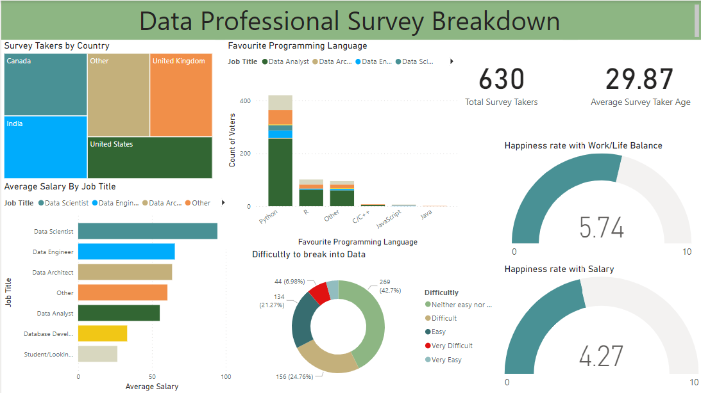
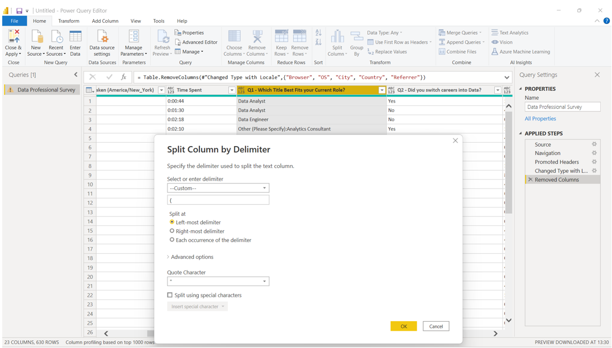
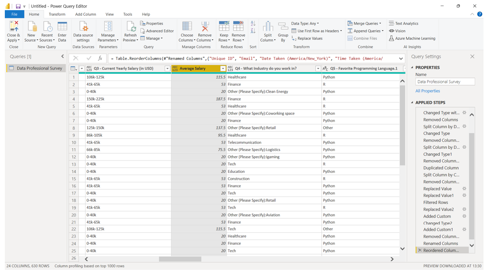
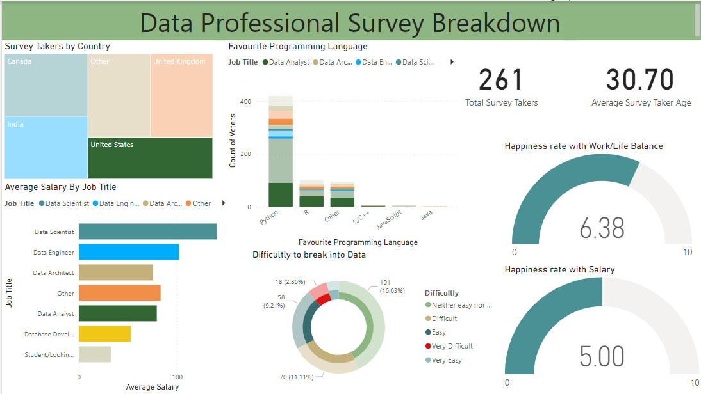

# DataProSurvey
## Data Professional Survey Breakdown 
### PowerBI Interactive Dashboard 

Using a excel dataset about Data Professionals. Cleaning it then analysing the data and creating a dashboard all in PowerBI.

Software used: 
<li>Microsoft Excel: Dataset file imported into Power BI. 
<li>Microsoft PowerBI: To clean the data and build charts and then a dashboard. 
<li>Charts are Treemap, stacked bar chart, stacked column chart, card x2, Gauge x2 and Dount chart.

I removed columns that weren’t need. 

 
Split column by delimiter choose custom we want to move the '(' away from option because there is only one in that column. So the left-most delimiter will be the option to use. 
What this does is it’s going to separate it by this parenthesis it’s going to leave (other) it’s going to create separate columns for each of these options. After I deleted the column that I didn’t need. I did the same for Favourite Programming Language question also removing the SQL options. 
 
 

 
The currently yearly salary what I did with this was, I broke up these numbers 106-125 and then took the average of those numbers. Next duplicated the currently yearly salary column first and that was what I was using. Next took 106 and 125 created that into two separate columns; then I created a third column that collected the average of those two numbers. 

For which country do you live in question the column was split. Again a copy of this column that just got created then removed. Also did this for the what industry do you work in question. 

 
The data is ready to use.
  

 
On the dashboard when a user clicks on United States on the treemap it shows various data e.g. number of the survey takers from the US. Out of the 630 survey takers 261 were from the US. The average age of US survey takers was 30.70 or 31. The stacked bar chart is the Average Salary By Job Title, stacked column chart is Favourite Programming Language, card x2 is Total Survey Takers & Average Survey Taker Age, Gauge x2 is (Happiness rate with  Work/Life Balance & Happiness rate with Salary) and Dount chart is Difficultly to break into Data.
