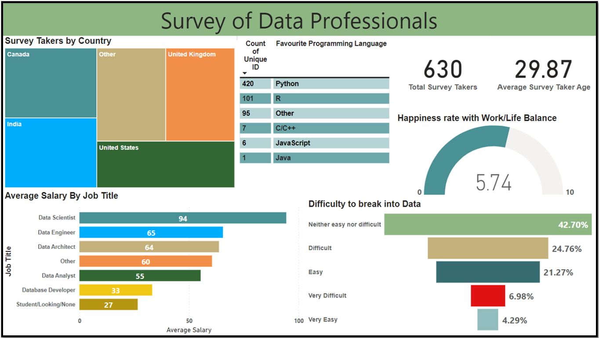
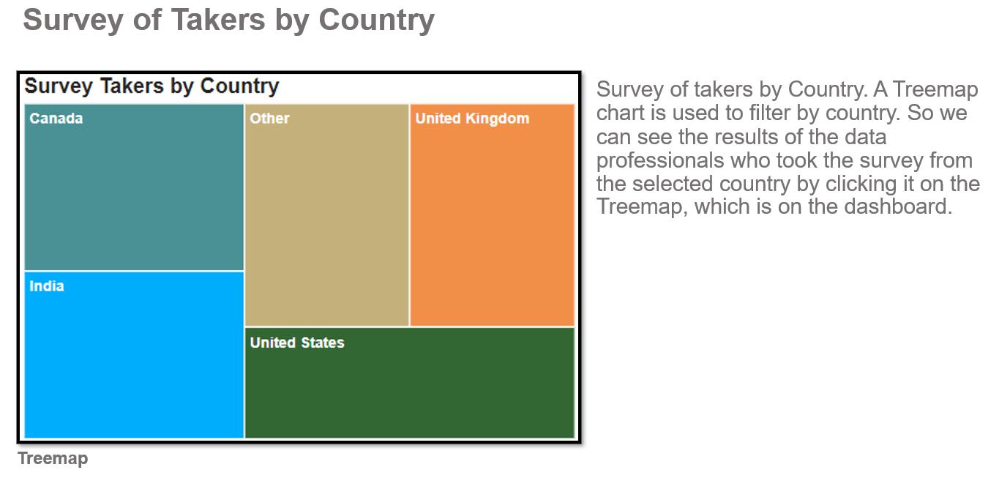
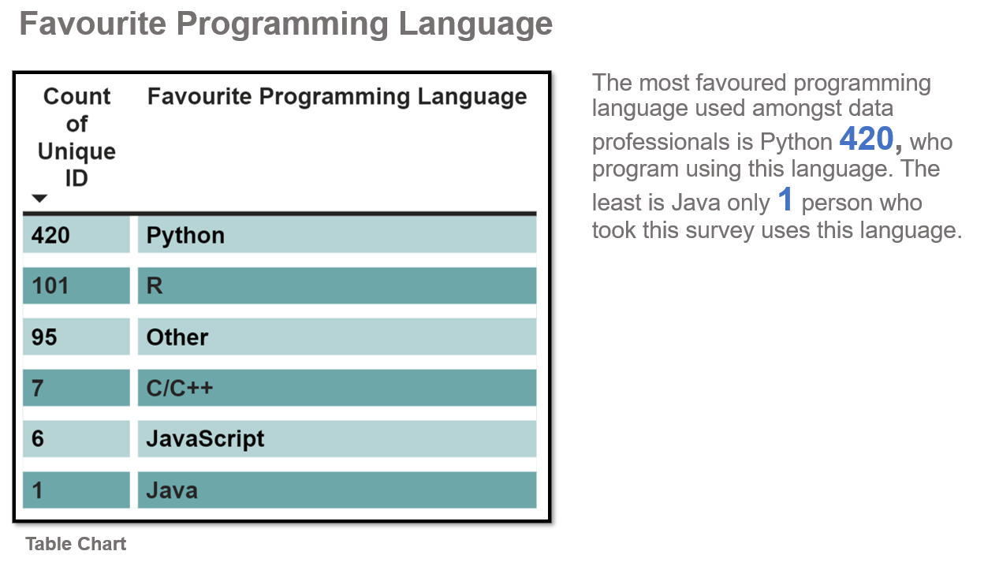
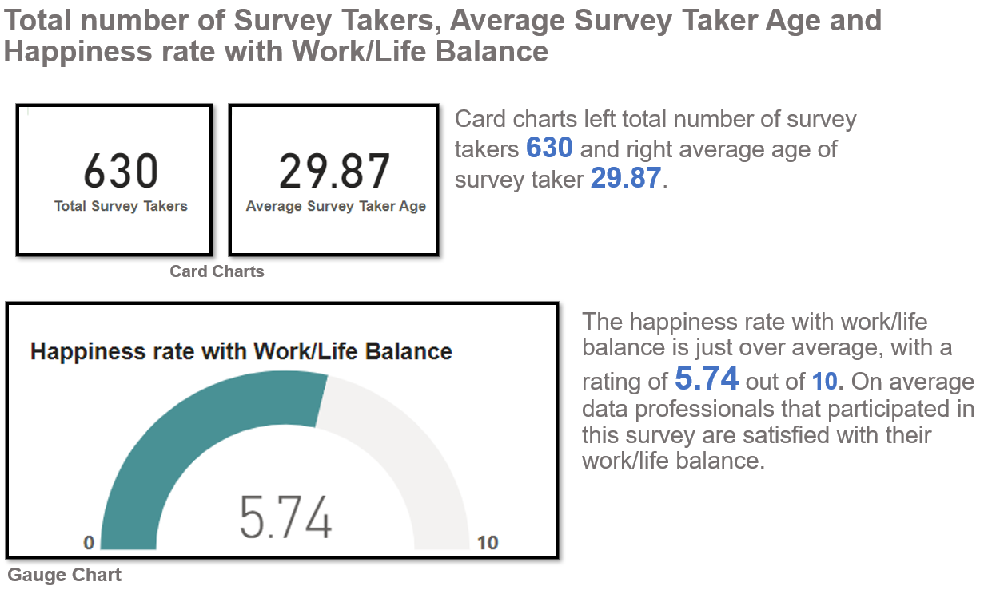
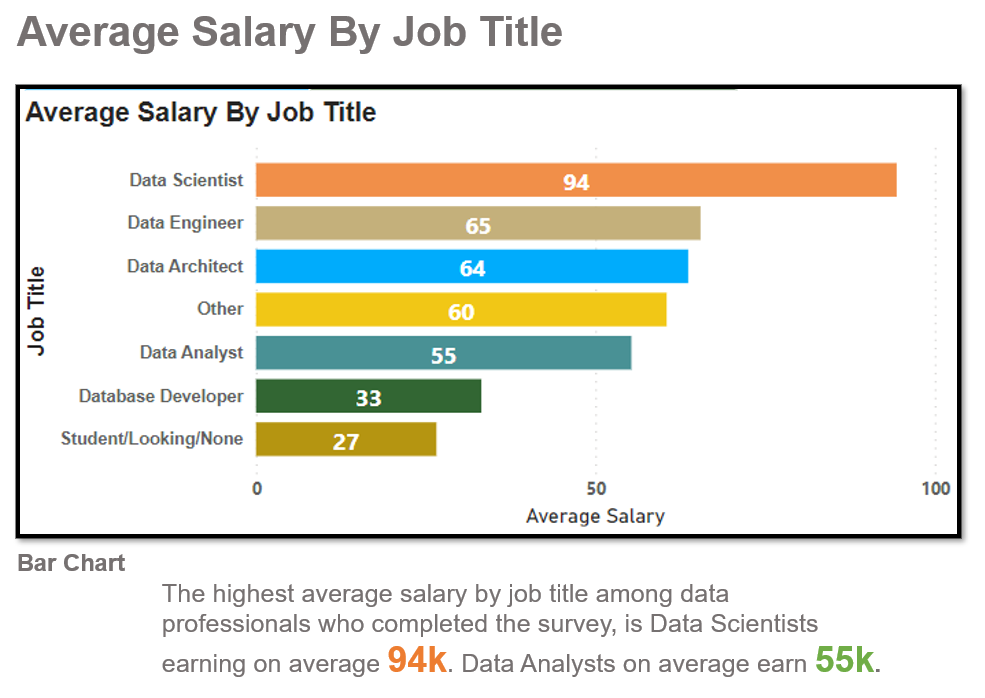
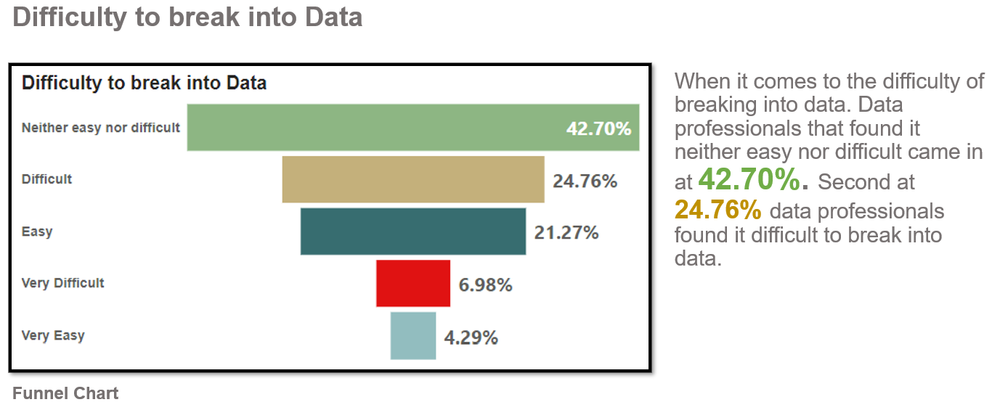
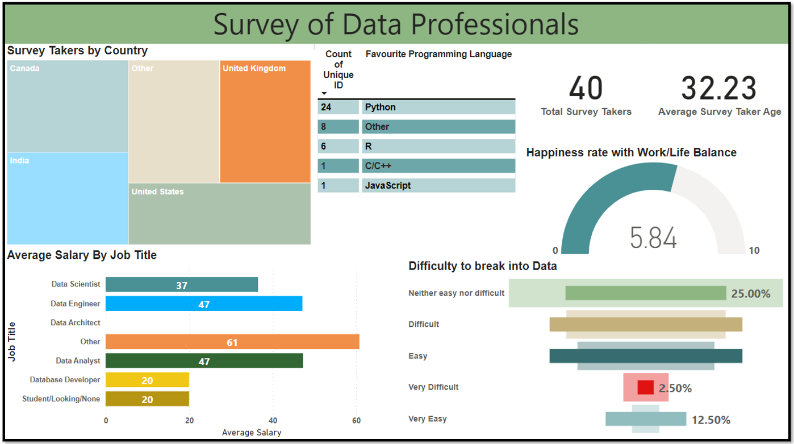

# DataProSurvey
## Survey of Data Professionals  
### PowerBI Interactive Dashboard 
 

### Survey of Data Professionals Interactive dashboard where you can filter survey takers by country. The countries you can filter through are Canada, India, United States, United Kingdom or Other.

In this report I will analyse the data of the data professionals, to have an understanding of the professionals in this industry. Number of survey takers 630, average age of survey taker is 30. 

I will mention: 

<li>Survey of takers by country.
<li>Favourite programming languages their like to use or have used.
<li>Happiness rate with work/life balance. 
<li>Average salary by job title. 
<li>Difficulty to break into Data.   

### Software used:  
Microsoft PowerBI: To clean the data, analysing the data and build charts and then a dashboard. 

Charts Used: Treemap, Table Chart, Card x2, Gauge, Bar Chart and Funnel Chart.

 

 

 

 

 

## Dashboard filter settings with survey takers by Country

 

### The survey is filtered by the United Kingdom. The average salary among data professionals in the United Kingdom that are Data Engineers earn on average 47K. The favourite programming language used in the United Kingdom is Python 24 out of 40 survey takers voted.  

## Summary

### In this report I analysed the survey results on:

<li>Favourite programming languages their like to use or used.
<li>Number of survey takers and average age of survey taker. 
<li>Happiness rate with work/life balance. 
<li>Average salary by job title. 
<li>Difficulty to break into Data.

### When it comes to the difficulty of breaking into the data industry. Overall Data professionals found it neither easy nor difficult came in at 42.70%. In the United Kingdom this came in at 25%. The most favoured programming language used amongst data professionals is Python this is also the same in the United Kingdom. The happiness rate with work/life balance is just over average, with a rating of 5.74 out of 10 it is 5.84 in the United Kingdom. The average salary among data professionals in the United Kingdom that are Data Analysts earn on average 47K.

